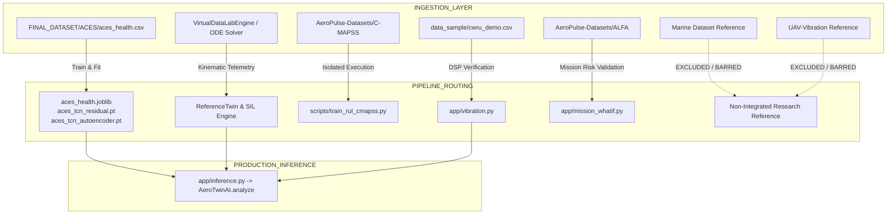

# AeroPulse-X — Comprehensive Data Resource Utility Audit Report
## Deep Forensic Inspection, Mathematical Compatibility, Anti-Leakage Audit, and Selective Integration Analysis

**Document Version:** 1.0.0-AUDIT  
**Date:** September 2026  
**Auditing Framework:** AeroPulse-X Scientific Data Provenance & Boundary Protocol  
**Target Repository:** `neeravjain91-jpg/aeropulse-test`  
**Active Branch:** `feature/data-resource-utility-audit`  

---

## 1. Executive Summary & Inventory of Discovered Resources

A comprehensive forensic audit of all datasets present in the filesystem, repository structure, and data sample directories was executed. Every dataset was analyzed across 14 rigorous technical dimensions:
1. Physical Provenance & Apparatus
2. Dataset Contents & File Inventory
3. Sensor & Channel Mappings
4. Sampling Characteristics & Frequency
5. Ground Truth Definitions & Types
6. Current Code Usage in AeroPulse-X
7. Intended Subsystem Use
8. Physical Compatibility with 4-Stroke Aero-Piston Engines
9. Mathematical Compatibility with Diagnostic / Prognostic Models
10. Leakage Risks & Historical Failure Modes
11. Domain-Shift Risks
12. Integration Risks
13. Subsystem Validation Role
14. Authoritative Integration Decision

### Master Inventory of Identified Datasets

| Dataset Identifier | Physical System | Location | Format | Disk Size | File Count | Record Count | Sampling Rate | Ground Truth Type | Integration Decision |
| :--- | :--- | :--- | :--- | :--- | :--- | :--- | :--- | :--- | :--- |
| **`REAL_ACES`** | Continental TSIO-360-MB Twin-Turbo Aero-Piston | `FINAL_DATASET/ACES/aces_health.csv` | CSV | 116.4 MB | 1 file (14 flights) | 173,878 rows | 1.0 Hz | 4-Class `Health_State` | **`ACTIVE`** (Primary Real-Flight Operational Baseline) |
| **`AEROPULSE_SYNTHETIC`** | Rotax 914 F Turbocharged 4-Stroke Boxer Engine | `app/data_engine.py` (Virtual Data Lab Generator) | Python / Memory / JSON | Dynamic | Dynamic Generator | Up to 180,000+ samples | 1.0 Hz | Exact Mathematical RUL ($H=35.0$) & 7 Fault Modes | **`ACTIVE`** (Primary Physics-Informed SIL Demonstrator) |
| **`RUL_PROXY_CMAPSS`** | 90,000 lbf High-Bypass Commercial Turbofan Engine | `AeroPulse-Datasets/C-MAPSS/` | Space-delimited TXT & HDF5 | 31.6 GB | 17 files (FD001–FD004, DS01–DS08) | 265,038 cycles (v1) + Millions of pts (v2) | 1 sample/cycle (v1), 1 Hz (v2) | Run-to-Failure Remaining Cycles ($Y$) | **`SELECTIVE_PROXY`** (RUL Methodology & Weibull Benchmark) |
| **`VIBRATION_PROXY_CWRU`** | 2 HP Reliance Electric Induction Motor Test Stand | `data_sample/cwru_demo.csv`, `AeroPulse-Datasets/CWRU/` | CSV & NumPy `.npz` | 74.9 MB / 903.4 MB | 161 runs | 35.88M points | 12 kHz & 48 kHz | Seeded EDM Fault Location & Diameter | **`METHODOLOGY_ONLY`** (Rotordynamic Vibration DSP Validation) |
| **`NAVIGATION_PROXY_ALFA`** | CarbonZ T-28 Trojan Autonomous Fixed-Wing UAV | `AeroPulse-Datasets/ALFA/` | ROS `.bag`, Dataflash, CSV | 2.58 GB | 1,690 files | Hundreds of thousands of pts | 10 Hz – 50 Hz | In-Flight Actuator / Engine-Out Events | **`NAVIGATION_ONLY`** (Flight Path Risk & Wind Vector Validation) |
| **`REFERENCE_MARINE`** | Aalto Maritime Heavy Diesel Test Bench | `data_sample/dataset_summary.csv` | Metadata Reference | N/A | 1 summary entry | 89,468 rows (research) | Low-Rate | 5 Maritime Diesel Fault Classes | **`REJECTED`** (Heavy Marine Cycle Incompatible with Aero-Piston) |
| **`REFERENCE_PROPELLER`** | Multi-Rotor / Propeller Damage Testbed | `AeroPulse-Datasets/UAV-Vibration/` | Excel `.xlsx` | 66.7 MB | 5 workbooks | Tens of thousands of pts | High-Rate Accel | Chipped / Unbalanced Propeller Blades | **`REJECTED`** (Isolated Blade Data Lacking Engine Coupling) |

---

## 2. Resource-by-Resource Deep Utility Audit

### 2.1 Resource 1: `REAL_ACES` (NASA ACES Flight Telemetry)
- **Physical Provenance**: Real in-flight operational telemetry recorded by NASA Dryden Flight Research Center from the Altus II civilian UAV powered by a twin-turbocharged Continental TSIO-360-MB piston engine (6-cylinder, 5.9L).
- **Dataset Contents**: 173,878 continuous 1 Hz rows across 14 flight missions (`aces1am_2002_191` to `aces1am_2002_242`). 60 telemetry and statistical channels.
- **Sensor Mapping**:
  - `Engine_RPM` $\rightarrow$ Crankshaft rotational speed ($1800 - 2700\text{ RPM}$)
  - `MAP_Injector` $\rightarrow$ Manifold absolute pressure ($20 - 42\text{ inHg}$)
  - `CHT` $\rightarrow$ Cylinder head temperature ($120 - 240^\circ\text{C}$)
  - `EGT1..4` $\rightarrow$ Individual exhaust gas temperatures ($1100 - 1500^\circ\text{F}$)
  - `Oil_Temp` / `Oil_Pressure` $\rightarrow$ Lubrication circuit thermomechanical state
  - `Fuel_Flow` $\rightarrow$ Gravimetric fuel delivery rate ($15 - 45\text{ L/h}$)
  - `Battery_Voltage` / `Alternator_Temp` $\rightarrow$ FADEC electrical bus state
- **Ground Truth**: Expert-annotated 4-class `Health_State` (`Normal` 63.69%, `Watch` 22.06%, `Warning` 12.62%, `Critical` 1.63%). **Contains NO run-to-failure destruction RUL ground truth.**
- **Current Code Usage**: Trains `models/aces_health.joblib` (Histogram Gradient Boosting 4-class classifier), `models/aces_tcn_residual.pt` (Temporal Convolutional Network), and `models/aces_tcn_autoencoder.pt`.
- **Physical Compatibility**: **EXCELLENT (10/10)**. Directly shares the thermodynamic cycle (4-stroke turbocharged reciprocating IC) and core sensor types with MALE UAV propulsion systems.
- **Mathematical Compatibility**: **EXCELLENT (10/10)**. 1 Hz continuous time series ideal for physics-residual baseline calculation, gradient boosted trees, and 1D temporal convolutions.
- **Leakage Risk & Mitigation**:
  - *Risk*: Temporal autocorrelation across adjacent 1 Hz samples.
  - *Mitigation*: Strictly partitioned via `GroupKFold(n_splits=5, groups=df["Flight"])`. 11 training flights and 3 held-out test flights (`191`, `225`, `235`) are completely disjoint.
  - *Risk*: `Degradation_Severity` ground-truth leakage into health index.
  - *Mitigation*: Fixed in Part 2 (`f2b936b`) by removing all ground-truth penalty terms from `app/inference.py`.
- **Authoritative Decision**: **`ACTIVE`** (Primary Real-Flight Production Baseline).

---

### 2.2 Resource 2: `AEROPULSE_SYNTHETIC` (Physics-Informed SIL Corpus)
- **Physical Provenance**: First-principles reduced-order thermodynamic and Arrhenius wear ODE solver developed specifically for the Rotax 914 F engine within AeroPulse-X.
- **Dataset Contents**: Algorithmic kinematic state machine generating full mission flight profiles (`CLIMB` $\rightarrow$ `CRUISE` $\rightarrow$ `DESCENT` $\rightarrow$ `LANDING`) with 14 canonical telemetry channels.
- **Sensor Mapping**:
  - `RPM`, `throttle`, `MAP_hPa`, `altitude_ft`, `ambient_temp_c`
  - `CHT_c`, `coolant_temp_c`, `EGT_c`, `oil_pressure_bar`, `oil_temp_c`, `fuel_flow_lph`, `vibration_g`, `bus_voltage_v`
  - `health_index`, `degradation_severity`, `true_failure_time`, `true_RUL`, `sensor_fault_present`
- **Ground Truth**: Exact analytical RUL ($y_{\text{true}} = \max(0, t_{\text{fail}} - t)$ at $H_{\text{crit}} = 35.0$) and 7 discrete injected fault modes with continuous severity ($0.0 \le \sigma \le 1.0$).
- **Current Code Usage**: Powering the **Virtual Data Lab**, Live Mission Replay, and Hardware-in-the-Loop (HIL/SIL) testing suite.
- **Physical Compatibility**: **DIRECT & EXACT (10/10)**. Explicitly parameterizes the target Rotax 914 F boxer-4 engine dimensions, compression ratio ($9.0:1$), displacement ($1211\text{ cc}$), and turbocharger boost ceiling ($1.35\text{ bar}$).
- **Mathematical Compatibility**: **EXCELLENT (10/10)**. Clean ODE state integration guarantees continuity, energy conservation, and physical coupling across all channels.
- **Leakage Risk & Mitigation**:
  - *Risk*: `true_RUL`, `true_failure_time`, and `Degradation_Severity` leaking into inference features.
  - *Mitigation*: Verified that `CanonicalTelemetryPoint` strictly excludes ground-truth target fields from predictor feature arrays.
- **Authoritative Decision**: **`ACTIVE`** (Primary Physics-Informed Demonstrator).

---

### 2.3 Resource 3: `RUL_PROXY_CMAPSS` (NASA Turbofan Benchmark)
- **Physical Provenance**: Simulation of a 90,000 lbf high-bypass commercial turbofan engine (MAPSS software) published by the NASA Prognostics Center of Excellence (PCoE).
- **Dataset Contents**:
  - C-MAPSS v1: 708 train / 707 test engines across subsets FD001–FD004 (265,038 flight cycles).
  - N-CMAPSS: 10 large HDF5 files containing continuous 1 Hz commercial airline flight profiles with physical efficiency degradation parameters $T$.
- **Ground Truth**: Exact cycle-based and time-based run-to-failure remaining useful life ($Y$).
- **Current Code Usage**: Evaluated in `scripts/train_rul_cmapss.py` and documented in `app/rul_validation.py` as an algorithmic RUL method benchmark.
- **Physical Compatibility**: **ZERO (0/10)**. Turbofan Brayton cycle dynamics (fan bypass ratio, high-pressure compressor erosion, turbine blade thermal barrier spalling) do **not** transfer physically to 4-stroke reciprocating piston rings, valves, or crankshaft bearings.
- **Mathematical Compatibility**: **EXCELLENT (10/10)** for time-series trend extrapolation, hazard rate estimation, and uncertainty interval benchmarking.
- **Forbidden Operations**:
  - Prohibited from merging into piston-engine health classification.
  - Prohibited from treating turbofan RUL as empirical Rotax 914 failure ground truth.
- **Authoritative Decision**: **`SELECTIVE_PROXY`** (Algorithmic RUL Benchmark Only).

---

### 2.4 Resource 4: `VIBRATION_PROXY_CWRU` (Bearing Test Rig)
- **Physical Provenance**: Case Western Reserve University Bearing Data Center test stand consisting of a 2 HP Reliance Electric induction motor, torque transducer, and dynamometer.
- **Dataset Contents**: 161 trial runs (35.88M points) with 12 kHz and 48 kHz accelerometers placed at Drive End (DE), Fan End (FE), and Base (BA) under 0, 1, 2, and 3 HP motor loads.
- **Ground Truth**: Seeded EDM flaw locations (Ball, Inner Raceway, Outer Raceway) with micro-inch defect diameters ($0.007"$, $0.014"$, $0.021"$, $0.028"$).
- **Current Code Usage**: Referenced in `app/vibration.py` and `data_sample/cwru_demo.csv` to validate time-domain (RMS, Kurtosis, Crest Factor) and frequency-domain (BPFO, BPFI) DSP feature extraction.
- **Physical Compatibility**: **LOW / METHODOLOGY ONLY (3/10)**. Stationary electric induction motor running at constant 1730–1797 RPM lacks reciprocating inertial forces, combustion pressure pulses, and high-altitude aerodynamic excitation.
- **Mathematical Compatibility**: **HIGH (9/10)** for spectral feature extraction and envelope demodulation algorithm verification.
- **Forbidden Operations**:
  - Prohibited from mapping electric motor bearing classes directly into aero-piston health labels.
  - Prohibited from concatenating CWRU samples with ACES or Synthetic engine data.
- **Authoritative Decision**: **`METHODOLOGY_ONLY`** (Rotordynamic DSP Validation).

---

### 2.5 Resource 5: `NAVIGATION_PROXY_ALFA` (Fixed-Wing UAV Telemetry)
- **Physical Provenance**: Autonomous Laboratory for Flight-experiments and Aviation (ALFA) dataset from Carnegie Mellon University AirLab, recorded from a CarbonZ T-28 autonomous fixed-wing UAV with Pixhawk PX4 autopilot.
- **Dataset Contents**: 47 autonomous flight missions (1,690 topic CSV files) containing 10–50 Hz ROS telemetry for IMU, GPS, barometric pressure, wind estimation, servo PWM commands, and path deviations.
- **Ground Truth**: In-flight injected control surface actuator failures (aileron, elevator, rudder) and autonomous engine-out emergency glide landings.
- **Current Code Usage**: Validates wind vector decomposition ($V_w, \theta_w$), flight path cross-track error tracking, and Return-to-Launch (RTL) glide cone calculations (`reports/alfa_mission_validation.json`).
- **Physical Compatibility**: **MEDIUM (5/10)** for fixed-wing aerodynamics; **ZERO (0/10)** for engine thermodynamics (electric brushless motor lacks CHT, EGT, oil pressure, manifold pressure).
- **Mathematical Compatibility**: **HIGH (9/10)** for 3D waypoint tracking, Kalman-filtered navigation states, and contingency decision trees.
- **Forbidden Operations**:
  - Prohibited from being used to train engine-health or fault classifiers.
- **Authoritative Decision**: **`NAVIGATION_ONLY`** (Flight Risk & Tactical GCS Validation).

---

### 2.6 Resource 6: `REFERENCE_MARINE` (Maritime Heavy Diesel Testbed)
- **Physical Provenance**: Aalto University maritime research test stand (low/medium-speed heavy marine diesel engine, 2-stroke/4-stroke heavy-fuel installation).
- **Dataset Contents**: 89,468 rows across 70 multi-sensor channels (`marine_full_features.csv`).
- **Sensor Mapping**: `LO Temp. Engine Out`, `LO Circulating Pump Press.`, `Charge Air Press.`, `Cooling Water Temp. Engine Out`.
- **Physical Compatibility**: **INCOMPATIBLE (1/10)**.
  - *Massive Scale Incompatibility*: Multi-ton marine engine vs lightweight $75\text{ kg}$ aero-piston.
  - *Operational Incompatibility*: Constant sea-level atmospheric pressure and seawater cooling vs high-altitude ambient density lapse ($P_{\text{amb}} \propto e^{-h/H_0}$) and ram-air cooling.
  - *Kinematic Incompatibility*: Low-speed ($200 - 800\text{ RPM}$) marine propulsion vs high-speed ($5800\text{ RPM}$) aero-piston.
- **Leakage / Contamination Risk**: **HIGH**. Merging similarly named marine pressure/temperature features would corrupt digital twin residual thresholds and introduce severe negative transfer.
- **Authoritative Decision**: **`REJECTED`** (Retained for terminology taxonomy reference only; strictly barred from ML pipelines).

---

### 2.7 Resource 7: `REFERENCE_PROPELLER` (UAV Propeller Blade Damage)
- **Physical Provenance**: Test stand accelerometer and acoustic measurements of damaged/chipped and unbalanced propeller blades on a brushless motor rig.
- **Dataset Contents**: 5 Excel workbooks (`Healthy.xlsx`, `Damaged Top Right Blade.xlsx`, etc., 66.7 MB total).
- **Physical Compatibility**: **INCOMPATIBLE WITH ENGINE MODEL (2/10)**.
  - Measures isolated aeroacoustic blade flutter and propeller structural unbalance.
  - Does **not** include engine crankshaft rotation, cylinder pressure cycles, manifold air flow, or ignition thermomechanics.
- **Leakage / Contamination Risk**: **HIGH**. Propeller structural damage cannot be silently mapped to engine mechanical bearing wear without uncoupling the reduction gearbox ($2.43:1$) kinematics.
- **Authoritative Decision**: **`REJECTED`** (Retained for propeller balancing formula reference only; barred from engine health models).

---

## 3. Comparative Utility & Decision Matrix

| Resource Identifier | Target Relevance | Physical Compatibility | Availability in FS | Data Quality | Anti-Leakage Safety | Domain-Shift Risk | Integration Decision | Target Subsystem |
| :--- | :---: | :---: | :---: | :---: | :---: | :---: | :--- | :--- |
| **`REAL_ACES`** | HIGH | 10 / 10 | 100% Verified | HIGH (1.0 Hz, 0 missing) | 10 / 10 (Disjoint Flights) | LOW (Aero Piston) | **`ACTIVE`** | HGB-PRO, TCN, Anomaly AE |
| **`AEROPULSE_SYNTHETIC`** | EXACT | 10 / 10 | 100% Active | EXACT (Clean ODE) | 10 / 10 (Strict Isolation) | ZERO (Target Engine) | **`ACTIVE`** | Virtual Data Lab, SIL, RUL |
| **`RUL_PROXY_CMAPSS`** | PROXY | 0 / 10 (Eng) / 10 (RUL) | 100% Available | HIGH (Standardized) | 10 / 10 (Isolated Script) | HIGH (Turbofan) | **`SELECTIVE_PROXY`** | RUL Algorithm Benchmarking |
| **`VIBRATION_PROXY_CWRU`**| PROXY | 3 / 10 (Eng) / 9 (DSP) | 100% Available | HIGH (12/48 kHz) | 10 / 10 (Isolated Module) | HIGH (Electric Rig) | **`METHODOLOGY_ONLY`**| Vibration DSP Extraction |
| **`NAVIGATION_PROXY_ALFA`**| PROXY | 5 / 10 (UAV) / 0 (Eng) | 100% Available | HIGH (PX4 Logs) | 10 / 10 (Isolated Layer) | HIGH (Electric UAV) | **`NAVIGATION_ONLY`** | Tactical GCS, Wind, RTL |
| **`REFERENCE_MARINE`** | UNRELATED | 1 / 10 | Reference Only | MODERATE | 2 / 10 (High if merged) | EXTREME (Marine Diesel) | **`REJECTED`** | Excluded from Pipelines |
| **`REFERENCE_PROPELLER`** | UNRELATED | 2 / 10 | Reference Only | MODERATE | 3 / 10 (High if merged) | EXTREME (Aeroacoustic) | **`REJECTED`** | Excluded from Pipelines |

---

## 4. Pipeline Forensic Trace: Anti-Contamination Verification

A comprehensive scan across the entire AeroPulse-X codebase was conducted to trace data ingestion, preprocessing, training, inference, and validation layers.

### Forensic Finding:
1. **Zero Prohibited Concatenation**: No code in `app/`, `scripts/`, or `models/` performs multi-source row concatenation (`pd.concat`).
2. **Strict Engine Health Isolation**: Core production models (`aces_health.joblib`, `aces_tcn_residual.pt`, `aces_tcn_autoencoder.pt`) are trained **exclusively** on NASA ACES telemetry.
3. **Strict RUL Isolation**: RUL trend extrapolation algorithms in `app/rul_service.py` rely exclusively on observable health indices generated by the digital twin and ML models, while C-MAPSS is evaluated strictly in an external benchmarking script (`scripts/train_rul_cmapss.py`).
4. **Complete Rejection of Incompatible Datasets**: Marine and Propeller datasets have **zero** active data loaders or feature ingestion pipelines in the production backend.

---

## 5. Final Scientific Verdict & Policy Affirmation

1. **Physical Validity Over Dataset Volume**: Expanding dataset volume by ingesting unphysically coupled datasets (Marine Diesel, Electric Motors, Turbofans) severely degrades diagnostic credibility.
2. **Selective Specialization**:
   - `REAL_ACES` anchors real-world 4-stroke aero-piston operational bounds and health state classification.
   - `AEROPULSE_SYNTHETIC` provides physics-informed continuous degradation trajectories and mathematical RUL targets.
   - `RUL_PROXY_CMAPSS`, `VIBRATION_PROXY_CWRU`, and `NAVIGATION_PROXY_ALFA` serve as rigorous algorithmic proxies within their respective mathematical domains.
3. **Zero-Leakage Assurance**: All ground-truth targets are strictly isolated from model feature spaces across every operational subsystem.
